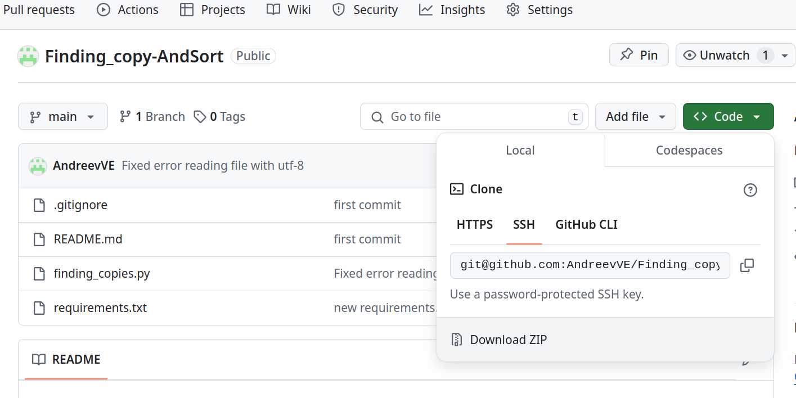
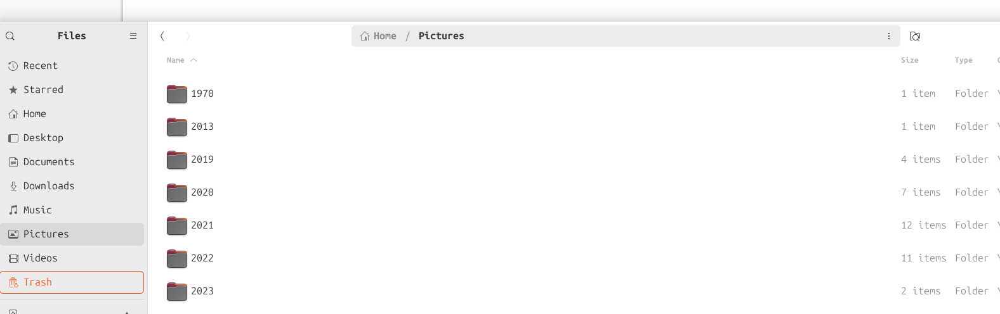

# Finding_copy-AndSort

Что умеет программа:

1. Искать копии файлов по указанному пути и создать файл со списком таких файлов.
2. Прочитать список из пункта 1 и в интерактивном режиме удалить ненужное.
3. Переместить файлы фото и видео в указанную директорию и разложить их по годам и месяцам.

Как установить?

1. Загрузка и установка Python:

    • Перейдите на официальный сайт Python (https://www.python.org/downloads/) и найдите раздел "Downloads".
    • Выберите последнюю стабильную версию Python для вашей операционной системы (Windows, macOS или Linux).
    • Загрузите установочный файл для выбранной версии Python.
    • Запустите установочный файл и следуйте инструкциям мастера установки.
    • Важно убедиться, что во время установки выбрана опция "Add Python to PATH", чтобы иметь возможность запускать Python из командной строки.
    • Откройте командную строку (в Windows можно нажать Win + R, ввести "cmd" и нажать Enter) 
    • Введите команду "python --version" и нажмите Enter на Windows 
    • Если вы видите версию Python, значит, установка прошла успешно.
    • Терминал не закрываем!
 
2. Скачать архив программы — Нажмите кнопку «Code» и выберите «Download ZIP»

3. Распакуйте загруженный архив.

4. В терминале переходим в директорию куда распаковали архив и вводи команду
    pip install -r requirements.txt

ВСЕ!

Как запускать?

1. Поиск копий.
	В терминале вводим команду: 
          python finding_copies.py -c C:\path\for\search C:\path\for\result
	Например:
                  python finding_copies.py -c С:\Users\slava\Documents C:\Users\slava

            В каталоге C:\path\for\result будет создан файл «Copies.txt»

2.Удаление копий файлов.
	 В терминале вводим команду: 
	      python finding_copies.py -r C:\path\for\result

             «C:\path\for\result» - путь куда сохраняли файл «Copies.txt»

3.Перемещение и сортировка фото и видео.
	В терминале вводим команду: 
	      python finding_copies.py -s C:\path\for\search C:\path\for\result

	« C:\path\for\search» - путь где лежат фото ( можно и с телефона)
	«C:\path\for\result» - тут будут созданы каталоги по годам и месяца и в них будут 	фото.

	
